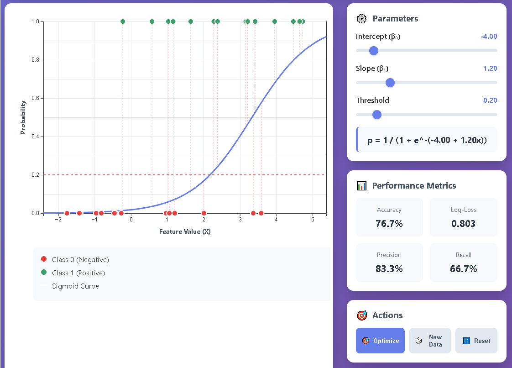

---
### 1. Предшествующие понятия (Фундамент)

Прежде чем крутить ползунки на экране, нужно понимать, на чем вообще всё строится:
* **Бинарная классификация:** Мы пытаемся разделить объекты строго на два лагеря. Например: "болен" или "здоров", "вернет кредит" или "кинет банк". Здесь это "Class 0" (красные точки внизу, негативный класс) и "Class 1" (зеленые точки вверху, позитивный класс).
* **Вероятность (Probability):** Мы не просто рубим с плеча "да" или "нет", модель математически оценивает шансы от 0 до 1 (то есть от 0% до 100%).
* **Линейная комбинация:** В основе лежит обычное уравнение прямой линии из школы: `z = Intercept + Slope * X`. Но прямая уходит в бесконечность, а нам нужны значения строго от 0 до 1 для вероятности.
* **Сигмоида (Sigmoid Function):** Это та самая математическая магия, которая берет прямую линию и изгибает ее в красивую букву "S". Формула там на экране: `p = 1 / (1 + e^-z)`. Она элегантно сжимает любые числа в диапазон вероятности `[0, 1]`.

### 2. Что происходит на графике

Допустим, мы предсказываем, купит ли клиент дорогой курс по Data Science.
* **Ось X (Feature Value):** Это наш признак. Пусть это будет количество просмотренных бесплатных вебинаров.
* **Ось Y (Probability):** Вероятность покупки курса (от 0 до 1).
* **Точки:** Это реальные люди из вашей истории наблюдений. Красные точки лежат строго на нуле - они ничего не купили. Зеленые точки лежат на единице - это красавчики, которые курс оплатили. Обрати внимание на график: чем больше X (больше посмотрели вебинаров), тем гуще кучкуются зеленые точки.
* **Синяя S-образная кривая:** Это и есть наша обученная модель логистической регрессии. Она показывает, как плавно растет вероятность покупки с каждым новым просмотренным вебинаром.

### 3. Зачем нужны ползунки?

На https://www.interactive-ml.com/logistic-regression.html можно вручную настраивать параметры уравнения:
* **Intercept (Сдвиг / Beta 0):** Двигает синюю кривую влево или вправо. Это некая "базовая предрасположенность" к покупке, независимая от вебинаров.
* **Slope (Наклон / Beta 1):** Регулирует крутизну "эски". Если наклон очень резкий, значит признак (вебинары) радикально меняет решение клиента от "точно нет" к "точно да". Если пологий - признак слабо влияет на результат.
* **Threshold (Порог):** Это красная пунктирная горизонтальная линия. Модель выдает математическую вероятность (например, 0.65). Но бизнесу нужно жесткое решение: звонить клиенту с предложением или забить? Порог - это рубильник. По дефолту он стоит на 0.5 (50%). Если синяя кривая для конкретного пользователя выше порога, алгоритм говорит "Купит!" (относит к классу 1). Если ниже - "Не купит" (класс 0). Двигая Threshold вверх или вниз, вы можете делать модель более осторожной или, наоборот, более агрессивной в прогнозах.

### 4. Метрики внизу (Performance Metrics)

Если генерировать новые датасеты кнопкой "New Data" или крутить ползунки, цифры внизу меняются:
* **Accuracy (Точность):** Общий процент правильных попаданий модели (сколько зеленых и красных мы в итоге угадали верно по отношению ко всем точкам).
* **Precision (Точность попадания):** Из всех, кому мы предсказали покупку (единичку), какая доля реально купила?
* **Recall (Полнота):** Какую долю из всех реально купивших красавчиков наша модель смогла найти?
* **Log-Loss:** Штраф за уверенность в ошибке. Чем меньше это значение, тем шикардос. Если модель самоуверенно заявляет "вероятность 99%, что купит", а клиент не покупает - штраф (Log-Loss) взлетит до небес.
---